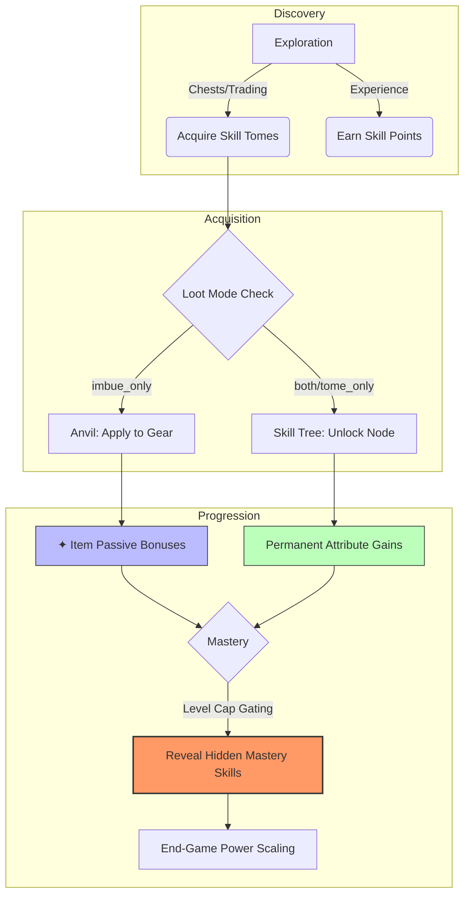

# Standardized Datapack Technical Reference

This document outlines the standard for robust, production-ready skill definitions within the Pufferfish Skill Leveling addon.

## The Player Experience Flow

The following diagram illustrates how players discover, acquire, and progress through the skill systems provided by this addon.



---

## Field Standardization

To ensure skills are correctly synced, buyable, and free of validation errors, follow this priority tiers for JSON fields.

### 1. Mandatory Fields (The "Core Five")
These must be present in every skill definition to avoid "unused field" warnings or broken functionality.

| Field | Description | Importance |
| :--- | :--- | :--- |
| `type` | Defines base behavior. Use `puffish_skills:default` or `puffish_skill_leveling:stackable`. | **Crucial** |
| `category_id` | Must match the category folder name. Required for Creative Tab integration. | **Crucial** |
| `points_per_level` | Required for purchasing levels in the skill tree. | **Crucial** |
| `max_skill_level` | Defines the ceiling for progression and gating. | **Crucial** |
| `metadata` | **REQUIRED** by Pufferfish Skills parser. Can be empty: `{"metadata": {}}`. | **Crucial** |

### 2. Highly Recommended (The "Polished UI" Duo)
These fields provide the necessary feedback for players to understand their progression.

- **`descriptions`**: Level-keyed map of current benefits.
- **`extra_descriptions`**: Level-keyed map for "Next Rank" previews.
    - *Tip:* Always include a `"0"` key in `extra_descriptions` to show players what Level 1 grants before they buy it.

### 3. Operational Fields (Feature Gating)
Used to control the flow and discovery of content.

- **`loot_mode`**: Controls acquisition path (`both`, `tome_only`, `imbue_only`).
- **`hidden`**: If `true`, the skill is invisible until `prerequisite_skills` are met.
- **`prerequisite_skills`**: Root-level requirements to unlock/reveal a skill node.
- **`required_skill_for_level`**: Gates specific *levels* of a skill behind other requirements.

---

## Technical Gotchas & Best Practices

### Reward Identification
When using `puffish_skill_leveling:per_level_rewards`, the internal `skill_id` **MUST** match the top-level key in `definitions.json`.
```json
"my_skill": {
    "rewards": [{
        "type": "puffish_skill_leveling:per_level_rewards",
        "data": {
            "skill_id": "my_skill",
            "levels": {
                "1": [
                    {
                        "type": "puffish_skills:attribute",
                        "data": {
                            "attribute": "minecraft:generic.max_health",
                            "operation": "addition",
                            "value": 2.0
                        }
                    }
                ],
                "2": [
                    {
                        "type": "puffish_skills:attribute",
                        "data": {
                            "attribute": "minecraft:generic.max_health",
                            "operation": "addition",
                            "value": 4.0
                        }
                    }
                ]
            }
        }
    }]
}
```

### Prerequisite Naming
The addon is lenient but prefers these standard keys for consistency:
- Use `skill` (alias for `skill_id`).
- Use `min_level` (alias for `level`).
- Always include `category` for cross-category requirements to avoid resolution ambiguity.

### Level 0 Management
A skill with 0 levels is considered "Unlocked (State: AFFORDABLE/AVAILABLE)". 
- Use `extra_descriptions: { "0": "..." }` to display the "Unlock" cost/benefit.
- Use `descriptions: { "0": "..." }` for base flavor text that appears before any levels are purchased.

---

## Matched Titles & IDs (The "Consistency" Rule)

To prevent confusion in logs, commands, and the UI, always ensure your `title` matches the internal `id` key.

### ✅ DO: Use identical strings
```json
"dragon_slayer": {
    "title": "dragon_slayer",
    "category_id": "combat",
    ...
}
```
*   **Why?** The addon uses the `id` for internal logic (like rewards and requirements) and the `title` for the UI. If they differ, it becomes much harder to debug which skill is which when looking at raw player data or using admin commands.

---

---

## Loot Modes & Point Logic (The "Dos and Don'ts")

The addon now features a robust "Paid Level Tracker" that ensures Skill Tomes don't consume your category points. However, to keep your datapack clean and user-friendly, follow these guidelines:

### ✅ DO: Use `points_per_level` for `both` and `default` modes
If a skill is meant to be purchasable in the tree, documentation and cost must be clear.

### ❌ DON'T: Leave `points_per_level` if using `imbue_only`
*   **Why?** Even if the tree blocks the purchase, the UI might still calculate "Affordability" and show the skill as "Not enough points" (Red/Locked) instead of "Loot Only".
*   **Recommendation**: Set `points_per_level` to `0` for `imbue_only` skills to ensure they always appear "Available" (revealed) once prerequisites are met, without implying a point cost.

### ✅ DO: Keep `points_per_level` for `tome_only` if you want a "Mixed" tree
*   If you want players to be able to *either* use a Tome *or* buy it in the tree, use `loot_mode: "both"`.
*   If you use `tome_only`, set `points_per_level` to `0`. This ensures that even if you manually give the player points, they see the skill as a free discovery rather than a locked-out purchase.

---

## Summary Checklist
- [ ] `category_id` matches folder name.
- [ ] `loot_mode` is set (Default is `both`).
- [ ] `points_per_level` is `0` for loot-only skills.
- [ ] `title` exactly matches the skill's JSON key.
- [ ] `extra_descriptions` includes a `"0"` entry for preview.
- [ ] `persistence` is managed via `metadata`.
